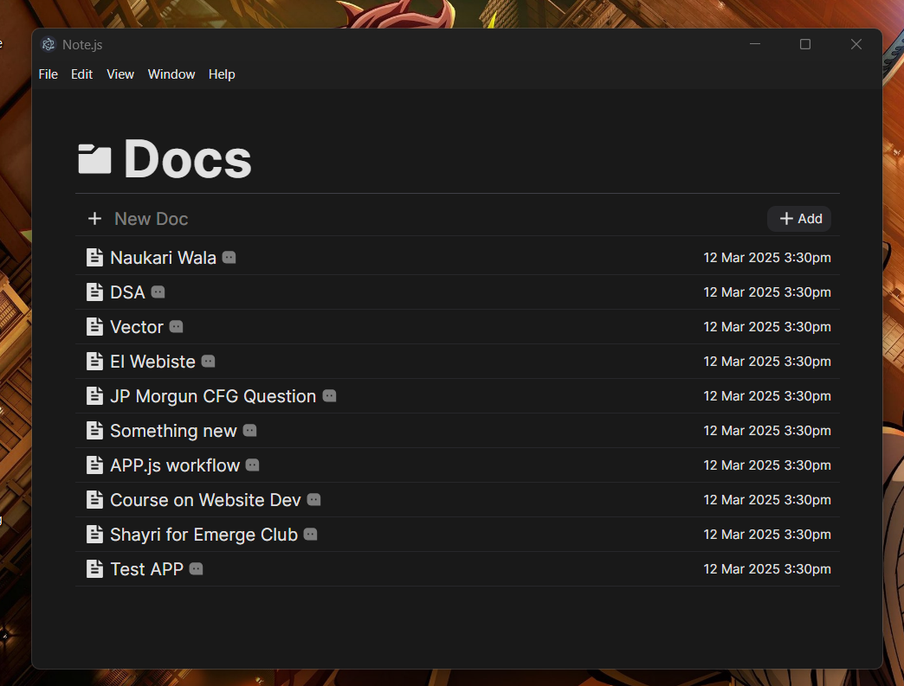
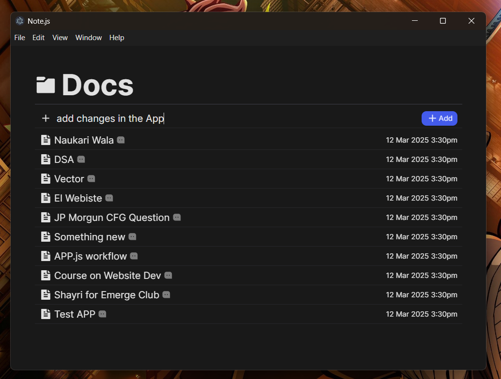
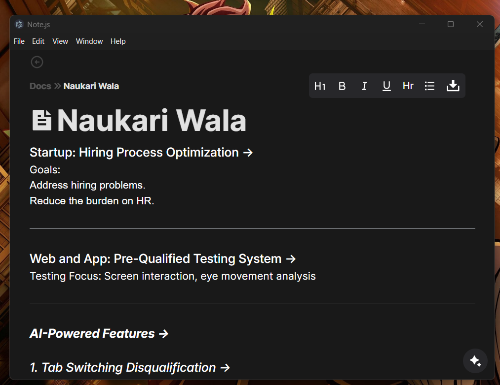
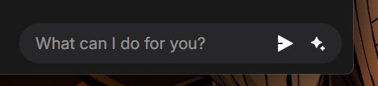
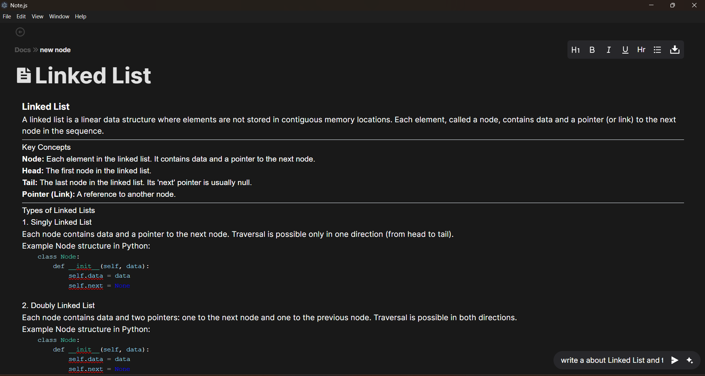
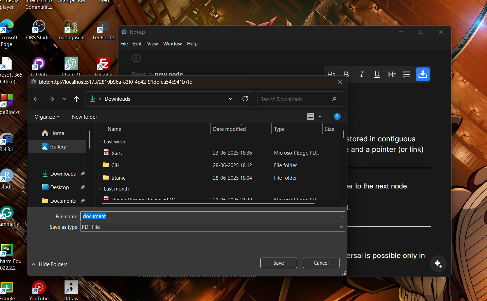
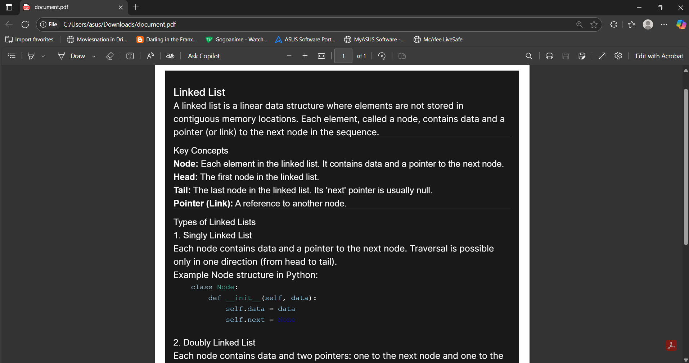

# 📝 Note.js

**Note.js** is a powerful and modern desktop note-taking application that extends the capabilities of a traditional notepad. Designed for students, professionals, and developers, Note.js combines sleek UI with AI-powered customization — allowing users to write, format, and even generate their own dashboards using Gemini integration.

---

## 🚀 About

Note.js is more than just a notepad — it's a fully interactive note editor with customizable UI and smart tools to boost your productivity. Featuring an intuitive layout and a built-in menu bar, users can easily format text, set font sizes, highlight content, and much more. What sets Note.js apart is its integration with **Gemini**: simply type a command, click "Send", and a personalized dashboard is generated instantly.

Whether you want a clean space to write, or an intelligent assistant to help you structure your workspace, **Note.js** adapts to your style.

---

## 📸 Screenshots

> Below are some screenshots showing the key features of Note.js in action.

### 🏠 Home Dashboard

---

### 📝 Create a New Note

---

### 🎨 Text Formatting Menu
Highlight text, set font size, bold, italic, underline.



---

### 🤖 Gemini Command Interface
Type your prompt and generate a custom dashboard.




---

### 📤 Export as PDF
Click to download your note as a beautifully formatted PDF.



---


## 🧑‍💻 Tech Stack

### 🔹 Frontend
- **React.js** – Core frontend library
- **Motion.js** – Smooth animations and UI transitions
- **Tailwind CSS** – Utility-first CSS framework for styling
- **Shadcn/ui** – Beautiful, accessible UI components
- **DOM Manipulator** – Custom utility for dynamic UI behavior

### 🔹 Backend
- **Express.js** – Lightweight Node.js web framework
- **Firebase Admin SDK** – Secure backend operations
- **Gemini API** – For AI-powered dashboard generation
- **PDFCanvas** – Convert notes to PDF format

### 🔹 Database
- **Firebase Realtime Database** – Store and sync user notes and configurations

---

## ✨ Features

- 📝 Create, edit, and delete note files
- 🎨 Format text with font size, bold, highlight, and more
- 📁 Organized UI with a functional menu bar
- 🤖 Gemini Integration: generate personalized dashboards via commands
- 📤 Export notes as PDFs
- ☁️ Save and sync notes with Firebase in real-time
- 💻 Desktop-first experience with responsive layout

---

## 📦 Getting Started

### Prerequisites
- Node.js and npm installed
- Firebase project setup
- Gemini API key

### Installation

```bash
git clone https://github.com/your-username/note.js.git
cd note.js
npm install
